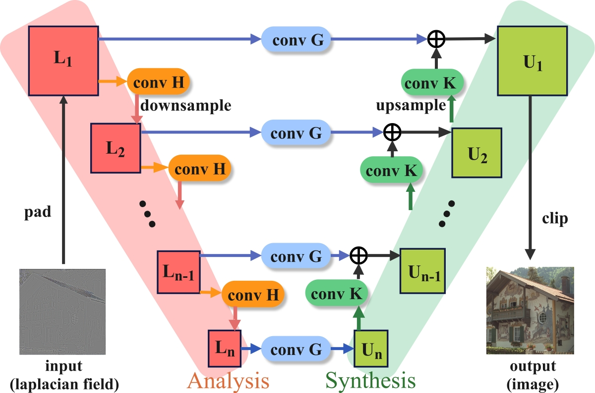
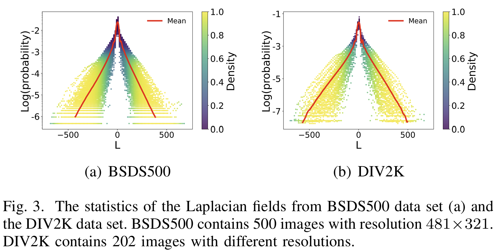
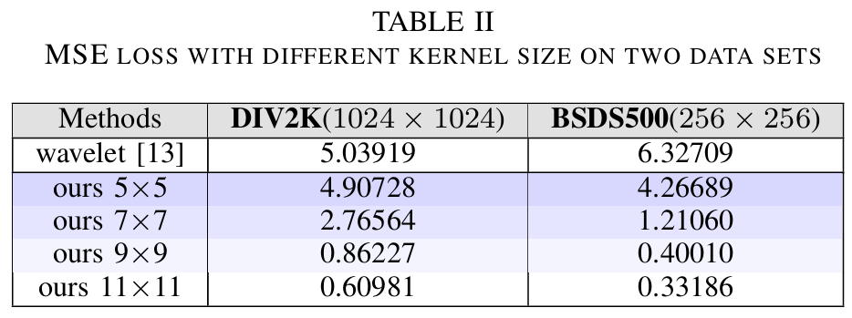
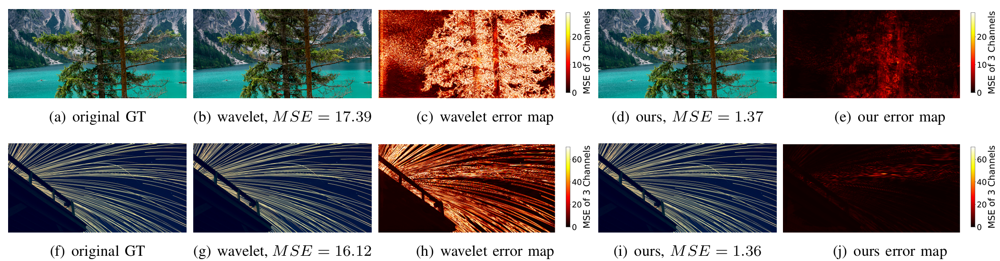

# swnet, [Paper](https://ieeexplore.ieee.org/document/11563717), [arxiv](https://arxiv.org/html/2604.24000v1)
Shared-Kernel Wavelet Networks for Near-Sensor Poisson Image Reconstruction, accepted by IEEE Sensors Journal

## 1) wavelet guided neural networks with shared-kernel

## 2) Laplacian Fields are sparse and statistically stable.

## 3) train the network for Poisson equation

## 4) our method is more accurate

